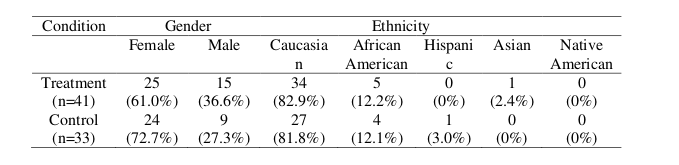
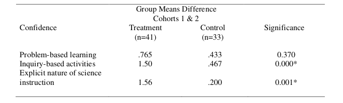
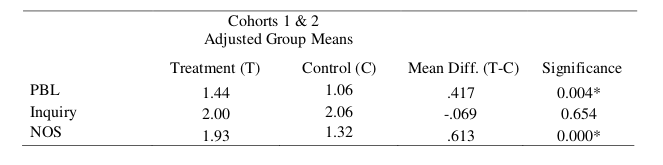
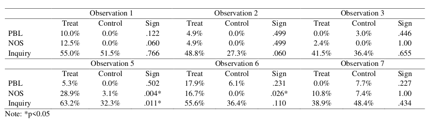

# Frog Engine (http://www.ferretengine.com/)

<html xmlns="http://www.w3.org/1999/xhtml" lang="en"><head>
<meta http-equiv="content-type" content="text/html; charset=UTF-8">
        <meta charset="UTF-8">
        <meta name="viewport" content="width=device-width, initial-scale=1.0">
    </head>
    <body>
        <h2>Introduction</h2>
        

Science teaching and science teacher quality is of international concern (Howe, 2006).
However, the teaching workforce in many countries is changing. For instance, science and
mathematics teachers have changing patterns of professional persistence, with some reports
indicating that 40% to 50% of new mathematics and science teachers leave the classroom in their
first three to five years (Cooper &amp; Alvarado, 2006; Ingersoll, 2003; Ingersoll &amp; Perda, 2012). In
the United States (US), this revolving door phenomenon has resulted in a teacher workforce that
is comprised of many first-year teachers (Ingersoll &amp; Merrill, 2012; Ingersoll &amp; Strong, 2011).
Due to a combination of internal and external factors, the first years of teaching are
undeniably some of the most challenging in a teacher’s career (Luft, Dubois, Nixon &amp; Campbell,
2014). In the US, novice science teachers are more likely than their more experienced peers to
teach in high-poverty schools with students from groups that are historically underrepresented in
the sciences. Many K-12 novice science teachers also have limited degrees or preparation in
science, engineering, or science education (Banilower et al., forthcoming).

Thus, one challenge facing science education is to improve teacher performance and
support in the early formative years. This translates into crafting teacher preparation, induction,
and professional development (PD) programs that maximize the learning of beginning teachers.
Science-specific support and PD programs have been shown to increase teachers’ practices in
science (e.g., Luft, 2001, 2009; Luft et al., 2011; McGinnins &amp; Simmons, 1999). This is
particularly important in the US where reform-based science instruction expects that students
will develop an understanding of science through the incorporation of scientific knowledge,
scientific practices, and the nature of science (NOS) (NRC, 1996, 2012). As a result, teachers are
expected to enact effective science instruction, which includes inquiry and scientific practices,
NOS, and problem-based learning (PBL). These typically occur in a classroom environment that
is student-centered with the teacher as a facilitator.

However, there is little understanding of how beginning teachers learn to teach science in
reform-based ways. While it is known that this enactment is complex, there is a need to know
more about how science-specific induction and/or PD programs can support the type of
instruction envisioned in education reforms (Luft et al., 2014). This study investigates how a
state-wide, science-specific induction program for beginning secondary science teachers
impacted the confidence, understandings, and practices of the teachers’ NOS, PBL, and inquiry
instruction.

The context of this study was a state-wide induction program in a mid-Atlantic state that
supported beginning secondary science teachers through their beginning years in the classroom.
This was a randomized controlled trial investigation, with treatment participants receiving
instruction and support through the induction program, called the Secondary Teacher Program
(STP). This induction program focused on assisting the novices to develop their knowledge and
practices to teach science as inquiry, explicit NOS, and PBL in a collaborative environment that
promoted learning, feedback, reflection, coaching, and practice.

Thus, the purpose of this study was to understand how beginning secondary science
teachers learned to implement science as inquiry, NOS, and PBL as a result of participation in a
science-specific induction program. The guiding questions for this study were:
(1) How did treatment participants’ confidence, understandings, and practices of NOS,
PBL, and inquiry change over time as a result of participation in the induction program as
compared to the control group?

(2) What results emerge from comparing the exploratory qualitative data about the
participants’ confidence and understandings of NOS, PBL, and inquiry with the outcome
quantitative data measured from participants’ perceptions surveys and classroom
observations?

<h2>Theoretical Perspective</h2>
<b>Teacher Learning Continuum</b>

This study is framed within a teacher learning continuum perspective. Feiman-Nemser
(2001) focused on early career teacher learning and emphasized, “New teachers have two jobs,
they have to teach and they have to learn to teach. No matter how good a preservice program
may be, there are some things that can only be learned on the job” (p. 1026). Induction, then, is
seen as a unique phase of transition and development, from being a student of teachers to being a
teacher of students. Feiman-Nemser (2001) suggested that teachers often learn to teach in distinct
phases. The first phase involves the preservice program, where teachers build knowledge and
skills. The second phase builds upon these skills and knowledge and continues in the following
years. Additionally, Feiman-Nemser’s (2001) framework recommended that teachers learning to
teach should have central tasks for each phase of development.

More recently, it has been recognized by educational researchers in content areas that
Feiman-Nemser’s (2001) model should accommodate the development of teachers’ content
knowledge, incorporate instructional methods to teach specific content, and emphasize learning
the processes of science (Luft et al., 2010; Luft, Wong, &amp; Semken, 2011). The result is a variety
of central tasks associated with different phases of beginning teacher development focusing on
content knowledge, instructional practices and teacher professionalism in science (see Luft et al.,
2010; Luft, Wong, &amp; Semken, 2011). For example, teachers who are just beginning the process
of becoming educators should focus on developing subject matter knowledge, while those in the
induction phase should extend their subject matter knowledge and develop instructional practices
that incorporate the processes of science. Likewise, preservice teachers should develop a
beginning science teacher identity and whereas those in the early years should develop a
professional identity and leadership skills. Engaging in coordinated central tasks during
preservice, induction, and professional development (PD) programs may help teachers sustain
and increase their effectiveness.

Induction, situated on a teacher learning continuum, allows for a more complete
understanding of teacher development (Luft, 2003, 2007). The theoretical framework of a
teacher learning continuum and coordinated central tasks provides a progression of how new
science teachers should learn and improve their instruction. However, this progression may not
always happen.

<h2>Review of Relevant Literature</h2>
<b>Beginning Science Teachers’ Confidence and Self-Efficacy</b>

Self-efficacy is an internal factor that can have external results. Teacher self-efficacy
which is an internal factor that can influence the instruction of beginning science teachers
(Anderson et al., 2004; Ginns &amp; Watters, 1999; Haigh &amp; Anthony, 2012). One component of
self-efficacy described by Bandura (1986) is personal self-efficacy which is an individual’s
confidence in performing a task.

Self-efficacy is an important aspect of teacher learning, as self-efficacious teachers are
known to reflect, plan, and enact engaging instruction and are resilient to overcoming obstacles
(Chen et al., 2015). Additionally, self-efficacy is related to teacher identity and agency (Cantrell
et al., 2003; Chen et al., 2015; Webb, forthcoming). Agency defined as how teachers’ participate

within historical, institutional, and political structures and groups is situated in self-efficacy, and
both constructs contribute to the development of beginning teacher identity (Kelly, 2012). Yet,
developing teacher identity, agency and self-efficacy are multifaceted processes that involve
complex interaction between agency and structure (Tobin &amp; Llena, 2012).

Although studies exist on the development of preservice teachers’ self-efficacy through
teacher preparation programs (e.g., Akerson &amp; Donnelly, 2008; Settlage et al., 2009), little is
known about how induction programs can impact both self-efficacy and agency of beginning
secondary science teachers through the induction years. In this study, confidence is used as a
measure to understand teachers’ perceptions to enact reform-based practices, including inquiry,
NOS, and PBL. Confidence, although only one component of self-efficacy, can illuminate some
of the intricacies in this complex construct.

<b>Beginning Science Teachers’ Knowledge and Understandings</b>

Research on science teacher knowledge has been a scholarly interest for decades (Abell,
2007; van Driel et al., 2014). One component of teacher knowledge is subject matter knowledge
(SMK) which is composed of substantive structures and syntactical structures (Schwab, 1964).

Substantive structures are knowledge of concepts within a science discipline, whereas syntactical
structures are knowledge of the processes of science. There is ongoing debate about the role
content knowledge (i.e., substantive structure) plays in teachers’ instruction; however, there are
far fewer studies that have focused on beginning science teachers’ knowledge and
understandings of instructional approaches in science education reforms (i.e., syntactical
structures).

Studies that focus on beginning science teachers’ syntactical knowledge structures, give
attention to the relationship between understandings and practice. For example, Lederman (1999)
studied five novice secondary teachers’ understandings of NOS and found their understandings
aligned with reform-based NOS ideas. However, the novices’ instructional practice did not align
with their understandings of NOS. Similarly, Beyer and Davis (2008) found a misalignment
between a beginning elementary teacher’s correct understandings of scientific explanations and
her lack of enactment of this in the classroom. Roehrig and Luft (2004) echoed these findings
with the construct of inquiry with secondary teachers. They found that even teachers’ with
sophisticated understandings of inquiry had limited instances of enacting inquiry instruction.
Alternatively, Demir and Abell (2010) found that secondary science teachers held incomplete
views of inquiry even with an inservice support program and only one teacher actually enacted
this type of instruction.

   
The results of these studies suggest that a teachers’ knowledge and understandings of the
processes of science may have some influence on instruction. Yet, how this knowledge develops
and influences instruction is likely a combination of many factors. Despite the amount of
research in teacher knowledge, it is unclear what understandings beginning secondary science
teachers have of inquiry, NOS, and PBL and how this develops with time.

<b>Beginning Science Teachers’ Reform-Based Practices</b>

In the early years of their careers, beginning secondary science teachers’ instructional
practice is forming and fluctuating (Simmons et al., 1999). This development of practice is
simultaneously occurring in the midst of active educational reform, causing constant
modification and adaptation to the latest education reforms. In science education, reform-based
teaching often includes instructing in interactive and student-centered environments that allow
for the exploration of natural phenomena (NRC, 1996; 2012). This often involves asking
research questions, collecting and analyzing data, and constructing arguments from evidence.

The literature in this area has focused on the struggles beginning teachers encounter as they try to
enact reform-based science instruction. There have also been studies that focus on the potential
and promise of beginning science teachers as they learn to teach reform-based science.
It is well-established that new science teachers encounter challenges as they are learning
to enact reform-based science instruction (e.g., Bianchini &amp; Cavazos, 2007; Gilbert, 2011;
Roehrig &amp; Luft, 2004). For example, Roehrig and Luft (2004) followed 14 beginning secondary
science teachers in a science-specific induction program for the first year of teaching and
detailed the constraints experienced by beginning teachers when trying to implement science as
inquiry. Despite the science-specific induction program, even teachers who had inquiry
orientations toward teaching experienced barriers (e.g., classroom management and poor teacher
training) to implementing inquiry. Overall, the most serious constraint was the perceived low
student ability and motivation. Other constraints to reform-based teaching at the secondary level
noted in the literature include time, administrative support, and school contexts (e.g., Dubois &amp;
Luft, 2014; Gilbert, 2011; Loughran, 1994).

Despite challenges to enacting reform-based science instruction, it is also established that
new science teachers are capable of and energetic to engage in such instructional approaches
(Luft et al., 2014). Recently, researchers have shifted focus to the successes of beginning
secondary science teachers with the intention of focusing on what is working in order to inform
preparation and support programs (e.g., Alonzo et al., 2012; Bianchini &amp; Cavazos, 2007; Luft et
al., 2011; Windschitl et al., 2011). In one example study, Windschitl et al. (2011) supported 11
beginning secondary science teachers in a one year critical friends support group. Many of these
novices developed components of ‘expert-like’ teaching from the support of the group and from
learning to analyze student work.

These studies provide evidence of successes and challenges of beginning secondary
science teachers as they learned to enact reform-based science teaching. However, they do not
illuminate how the learning and implementation of reform-based science instructional
approaches might develop uniquely over time. In addition, reform-based instruction described in
the previous research aligned with inquiry-oriented approaches, yet NOS and PBL were often not
included explicitly. How implementation of each of these constructs of reform-based instruction
develops and develops over time is worthy of investigation.

<b>Induction and Professional Development Programs</b>

Professional development (PD) programs are designed to provide learning opportunities
for teachers beyond their initial preparation (Luft &amp; Hewson, 2014). In their comprehensive
review of the PD literature, Luft and Hewson (2014) indicated that science PD programs must
attend to content knowledge, but also to the knowledge teachers need to enact emerging reforms
that often require integrated science approaches. For new teachers, specifically, induction
programs are a form of professional development (Feiman-Nemser, 2010).

Induction programs vary widely in terms of requirement, content, and duration. Induction
programs are not mandated or required at the federal level in the US. Therefore, there is variation
in the types and duration of formal and informal support programs. While many schools in the
US require new teachers to have a mentor (who may or may not teach the same content as the
new teacher) and may have a yearlong support program for new teachers, this is only one type of
general induction support. On-site and off-site mentoring is an important support structure for
beginning science teachers (e.g., Haggarty et al., 2011; Koch &amp; Appleton, 2007; Ormond,
2011).Yet, the purpose and structure of mentoring or general support programs varies from site
to site.

The content included in induction programs also varies from location to location. Most
focus on general teaching strategies that can be applied to any content or grade level. However,
with more attention toward the knowledge and skills to teach science, studies by Luft and
colleagues have shown the importance of science-specific induction programs (Luft, Roehrig, &amp;
Patterson, 2003; Luft, 2009; Luft et al., 2011). Luft et al. (2011) followed teachers in four
different types of induction programs across five years. Those teachers in the science-specific
induction program had more enactment of inquiry-based instructional approaches than teachers
in general, e-mentoring, or alternative support programs.

However, research has also shown the important influence of school context on the
experiences of new teachers. Despite having some positive outcomes with the teachers’
instructional practices in the science-specific induction program, even Luft et al. (2011) found
that the teachers’ knowledge and experiences were guided more by school context. Likewise,
Bianchini and Brenner (2009) reported that school context strongly influenced the experiences of
new teachers who participated in an induction program. Acknowledging the crucial role context
plays in shaping the knowledge and experiences of beginning science teachers, researchers are
focusing on strongly equipping beginning science teachers with core high-leverage practices to
work within school contexts (Richmond, forthcoming; Windschitl et al., 2011).

All of these studies recognize induction as a unique phase of a teacher’s learning career
that may shape the persistence of an individual in the science classroom. The studies are also
attentive to content-specific support for beginning teachers who are developing their knowledge
and skills and recognize the crucial role of school context on teachers’ instruction practices. Yet,
while they were attentive to the science content, there was little distinction of how the programs
supported beginning teachers’ specific enactment of NOS and PBL in addition to inquiry
instruction.

<b>In Summary</b>

The literature reveals the importance of focusing on beginning teachers’ confidence,
understandings, and implementation of reform-based science instruction. Yet, it also indicates
there are some areas in need of further investigation. First, there is little understanding of the
development of teacher confidence of beginning teachers beyond preparation programs. Second,
although studies have focused on beginning teachers’ knowledge and implementation of reform-
based instruction, there have been no studies that focus on inquiry, NOS, and PBL or some
combination of the three. Most studies considered inquiry-oriented instruction, far fewer
consider NOS, and none considered PBL. Third, the majority of studies reviewed were
qualitative in nature. Methodologically, there is a need for studies that consist of contrasts and
novel ways to support new science teachers (Luft et al., 2014). The present study is a randomized
controlled investigation to see the effects of a science-specific induction program on the
development of beginning secondary science teachers’ confidence, understandings, and practices
over two years and addresses these gaps in the current literature on beginning teachers.

<b>Research Methods</b>

This embedded mixed methods design study followed guidelines in Creswell and Plano
Clark (2011). The quantitative data from the randomized controlled trial investigation guided the
analysis with the qualitative data collection and analysis occurring during and after the
quantitative design and analysis. The qualitative data is embedded within the larger quantitative
experimental design and provides a supportive, secondary role in the study.

<b>Participants/Context</b>

Participants across two years of two cohorts included 74 beginning secondary science
teachers teaching grades 6-12 science. These 74 teachers remained in years one and two of the
study. Through three rounds of randomization, participants were assigned to the treatment (n=41)
or control (n=33) group in each cohort. Treatment teachers received the full Secondary Teacher
Program (STP) support for two years, while control participants received no coursework,
support, or coaching through the program. Table 1 indicates the demographic data of
participants. All demographic data were self-report. To maintain confidentiality, all participants
were assigned a participant ID.

The goal of the induction program was to support beginning secondary science teachers
for two years. The induction program was implemented at four mid-Atlantic universities and the
support for the new teachers included: basic (year 1) and advanced (year 2) science methods
courses, on-site coaching, and a website of resources over the course of two years. In year 1, the
basic science methods course began in the summer and met seven times throughout the fall (45
contact hours). The course exposed participants randomized into the treatment group to reform-
based science instruction including inquiry, NOS, and some PBL. In addition, participants
practiced assessing student learning and analyzing student work. On-site coaches, many retired
science teachers, supported the new teachers planning, teaching, and problem-solving. In year 1,
coaches provided in classroom support the equivalent of 12 days (72 hours) during the school
year. Additionally, the participants attended the annual state science teachers’ conference for
ideas and novel approaches to teaching science.

In year 2, the advanced science methods course began in the summer and met throughout
the fall (45 contact hours). The course built on the year 1 basic methods course and helped
participants learn to modify instruction for diverse learners and embedded PBL instruction. On-
site coaches supported the new teachers again in year 2 for the equivalent of 18 hours. During
year 2, participants from each university site prepared a group presentation for a session at the
annual state science teachers’ conference. For a complete description of the program, see
Matkins et al. (2013).

<b>Data Collection</b>

There were three sources of data in this study. Data included perceptions surveys,
interviews of a subset of participants, and classroom observations. The first source of data was
perceptions surveys which were designed to elicit beginning teachers’ perceptions of confidence
and understandings to teach the key objectives of the induction program (i.e., inquiry, PBL, and
NOS instruction). The perceptions surveys were administered pre- and post- methods course in
years 1 and 2, and at the end of each teaching year for a total of six time points for the treatment
group. Control participants completed the perceptions survey at the beginning and end of each
year of participation for a total of four time points. The surveys contained Likert-scale items and
open-ended responses for confidence to teaching PBL, NOS, and science as inquiry. For
confidence, the scale ranged from 1 (not very confident) to 5 (highly confident). Open-ended
responses allowed participants’ to describe further details to their Likert-scale items and asked
participants to define and describe inquiry, NOS, and PBL instruction. Review by a panel of
experts in science education and research evaluation supported the face and content validity of
the instrument.

The second type of data was follow-up, semi-structured interviews with approximately
20% of participants at the end of years 1 and 2 for both cohorts. Participants were purposefully
selected based on changes in their pre- to post- survey scores. The interviews served to gather
information on participants’ views of the induction program, what they planned to implement,
and most and least valuable aspects of the induction program. The interviews were also a way to
member-check survey responses.

The final type of data was classroom observations that were conducted three times per
year, at regular intervals for all participants. Observers videotaped the science instruction,
collected contextual information about the observed lesson, and collected lesson artifacts. Prior
to videotaping the classroom observations, coaches and observers were trained to conduct the
videotaped classroom observations. The observation protocol was a modified version of the
Collaboratives for Excellence in Teacher Preparation Core Observation Protocol (CETP-COP)
(Lawrenz et al., 2002).

<b>Data Analysis</b>

The data analysis for this study was used to compare changes over time between
treatment and control participants. Participants’ data from the Likert-scale items on the
Perceptions survey were analyzed by inferential statistics. For confidence, a one-way analysis of
variance (ANOVA) was used to compare the mean differences from pre-year 1 to post-year 2
between treatment and control participants’ confidence in implementing NOS, PBL, and inquiry
instruction. Since the sample size differed between the two groups, the Welch statistic was
because it does not assume equality of population variances.

For understandings, a rubric was developed to assess how participants’ open-ended
survey responses to PBL, NOS, and inquiry aligned with the STP definitions. Responses were
coded as not aligned, partially aligned, and fully aligned (see Maeng &amp; Bell, 2012 for a
description of the rubric). Two raters independently coded the open-ended responses and if there
was disagreement, there was discussion until consensus was reached. A one-way analysis of
covariance (ANCOVA) was used to compare treatment and control participants’ post-year 2 end
understandings of PBL, inquiry, and NOS when controlled for pre-year 1 understanding.

The follow-up interviews and observations of the induction program were analyzed
through analytic induction described in Bodgan and Biklen (2007). Patterns and categories were
developed to understand the participants’ experiences in the induction program.
Classroom observations were analyzed with a modified version of the CETP-COP
(Lawrenz et al., 2002). This instrument captures instructional approaches, classroom
engagement, cognitive activity, and classroom organization in five-minute increments. Instances

of PBL, NOS, and inquiry instruction were coded in the instructional approaches section of the
protocol for both treatment and control teachers. The frequency findings were then analyzed
through inferential statistics. A two-way contingency table analysis was conducted to compare
treatment and control participants’ incorporation of PBL, NOS, inquiry and technology into their
instruction at six observation periods over the course of the two years. The two variables were
group with two levels (treatment and control) and incorporation of each of the VISTA strategies
(yes and no). Fisher’s Exact test was used to correct for cells with fewer than five occurrences.

<b>Results</b>

    The results are organized by participants’ confidence, understandings, and
    implementation of NOS, PBL, and inquiry. Within each of these areas, the quantitative results
    are presented first followed by qualitative interview or open-ended response data. The
    quantitative results are presented for the one-way ANOVA for participants’ confidence, the one-
    way ANCOVA for participants’ understandings, and the two-way contingency table analysis for
    the implementation.

<b>Confidence</b>

   
A one-way ANOVA was conducted to evaluate the relationship between participation in
    the STP program and change in confidence to implement inquiry, NOS, and PBL instruction
    from the first to the second year of the study. The group means difference from pre-year 1 to
    post-year 2 NOS and inquiry confidences for treatment participants were significantly higher (p
     .05) than the control group at the end of the two year STP (see Table 2). Treatment
    participants’ confidence to implement PBL improved over the two year STP, but not statistically
    different from control teachers.
    These results indicate that over time, treatment participants increased their confidence in
    incorporating STP strategies into their science instruction, and had significantly higher
    confidence than control participants in incorporating inquiry and explicit NOS. However, STP
    treatment teachers and control teachers had little change in confidence to incorporate PBL
    instruction from pre-year 1 to post-year 2.

    

    Qualitative data from the open-ended survey responses support the quantitative findings
    that the induction program increased treatment teachers’ confidence, particularly with inquiry
    and NOS instruction. For instance, participants stated:
    I feel much more confident with implementing inquiry lessons, and also lessons that
    emphasize the nature of science. (Post-Course Survey, Teacher S2-T239)
    I was very apprehensive about starting off with an entirely inquiry-based activity. By
    talking it out with professors and classmates, I learned different ways to ease into a
    full inquiry activity. I've also learned a lot about planning in nature of science
    qualities throughout the year. (Post-Course Survey, Teacher S2-T250)
    This increased confidence also translated into participants sharing ideas with colleagues
    in the department. In some cases, departments were supportive of the reform-based instruction
    while in other cases there was more resistance. Despite the latter, the VISTA STP program
    helped treatment teachers see the affordances to reform-based teaching.
    I gained confidence in my teaching of science. I realized that I knew a lot more than I
    was giving myself credit for. I was able to use assessment knowledge taught in class
    to help my team. My team is well established and it was great to add to what they
    have. (End Year Survey, Teacher S1-T3)

    
    

    I have learned a lot of content and strategies, being able to put a name to some of the
    techniques I was using in the classroom already. What I have most gained is the
    confidence that I am doing the right thing, even if my department thinks differently.
    Having the educational language to back up the practices will help me to defend what
    I am trying to do in my classroom. (Post Course Survey, Teacher S2-T217)
    I will use them in my own classroom and have already began sharing them with the
    science department at my school and specifically my grade level. It has made me feel
    more confident as a science teacher. (Post-Course Survey, Teacher S2-T251)
    As demonstrated by the above quotes, VISTA helped participants gain confidence to
    implement components of reform-based science teaching, such as inquiry and NOS. This
    increased confidence also helped participants to take initiative and share their reform-based
    science teaching approaches and ideas with colleagues.

    <b>Understandings of Inquiry, NOS, and PBL</b>

    
Table 3 displays a summary of the results from the one-way ANCOVA to compare the
adjusted mean difference between treatment and control participants’ understandings of inquiry,
NOS, and PBL from the beginning of year one (pre) and at the end of year two (post). The pre-
year 1 score was the covariate used in the ANCOVA to control for a baseline measure. The
differences in adjusted mean values for treatment participants in PBL and NOS understandings
from pre-year 1 to post-year 2 were significantly higher than the differences in adjusted mean
values of the control group (p .05). For knowledge of inquiry, there were no differences in
adjusted mean values from pre-year 1 to post-year 2 between control and treatment participants.
This data suggest that the STP was effective in increasing participants’ understandings of PBL
and NOS.

Qualitative data from interview participants and responses on perceptions surveys
illuminate some of the meaning behind the quantitative findings. Although the results for inquiry
understandings between treatment and control participants were not statistically significantly
different, qualitative interview and survey data revealed deeper understandings of the variations
in the levels of inquiry. For example, one participant remarked:

One of the things that has kind of stuck with me since the beginning of the course is when
we started talking about inquiry – levels of inquiry, meaning completely closed inquiry,
level 0 they called it, where there’s really no inquiry going on. Everything’s given to the
students, everything’s told to the student, there’s a certain definite answer that they’re
supposed to get. That’s the typical cookie cutter lab where you know if you didn’t get
this answer then you did it wrong. And then there were, I believe, levels 1, 2, and 3 after
that. And 3 was completely open inquiry where basically you tell the students ‘Here’s
the issue, I want you to learn about it’, and they have to come up with what problem or
question are they going to test. They have to come up with the experimental design; they
have to obtain their resources and really kind of run themselves through the entire
scientific process. (Interview, Teacher S1-T20)

Other qualitative data show how participants’ understandings of these constructs have
changed. One teacher indicated that she previously thought hands-on lessons were the same as
inquiry instructions, but her participation in VISTA helped her learn that this is not the case. This
is indicated by the following statement:

What exactly inquiry means and how to implement it. I used to think that hands-on
science was inquiry. I now understand the difference and how inquiry should incorporate
hands-on science. Before this course, nature of science was just something I skipped
over in the pacing guide. Now I understand the importance of going through the nature
of science in the classroom. The whole concept makes teaching science more relevant.
(Post Course Survey, Teacher S2-T268)

Additionally, other treatment teachers reflected on their understandings of NOS and PBL.
These understandings, as indicated by the teachers, have given them approaches to incorporate
these constructs into their instruction. For instance, teachers said:
I feel that the understanding of inquiry based science lessons, and the nature of science as
goals will prove to be of the most benefit to me as an educator. These ideas can be
incorporated into every unit that I teach with some prior planning, and will make the
content more meaningful and relevant for my students. (Post Course Survey, Teacher S2-
T229)

I found the problem based learning content to be very valuable. I find this incredibly
useful in my instruction of biology. I also find that I am much better at explicitly
teaching nature of science. This course has given me a more defined view of the
important aspects that need to be addressed as well as many great ways to teach them!
(Post Course Survey, Teacher S2-T216)

Interview data revealed some explanations for the similar comparisons in understanding
of inquiry between treatment and control participants. This data suggest teachers had previous
experience with inquiry before, whereas NOS and PBL were new constructs.

I think I have a pretty solid understanding of inquiry. I think that might be because that is
something that I’ve just been exposed to a lot even before VISTA and then getting more
and more practice with it. Nature of science was something that I heard for the first time
when I started VISTA. The more practice that I’ve done with it, the more it’s become
something that I can see integrating into an everyday lesson. Just kind of talking about
why do we need evidence or why is it a blend of logic and imagination … I never really
actually kind of thought about especially nature of science. So after participating in
VISTA that’s something that I see all the time when I’m planning lessons and sitting
down to write them… (Interview, Teacher S2-T243)

Well before I was a teacher I was an engineer so I had no traditional teaching experience,
so I don’t know how much exposure I would have had to those things. The only class
that might have touched on it was secondary methods. I definitely have heard of inquiry
in a lot of other places. I haven’t really heard about problem based learning in a high
school setting as much, or nature of science… I don’t think I would’ve known.
(Interview, Teacher S1-T6)

<b>Implementation of Inquiry, NOS, and PBL</b>

Table 4 displays the results of the two-way contingency table analysis that was conducted to
compare treatment and control participants’ incorporation of PBL, NOS, and inquiry into their
instruction at six observation periods over the course of the two years. The only statistically
significant results (p .05) were the inclusion of explicit NOS instruction in observation
windows 5 and 6, and the inclusion of inquiry instruction at observation 5 and these differences
favored the treatment group. This may indicate a developmental trajectory of participants in the
program where they are most likely to include STP strategies at the beginning and into the
middle of their second year in the program. The data also reveals that frequencies of inquiry and
NOS implementation decreased for treatment and control participants as the year progressed.

Most instances of PBL instruction were seen in year two, when it was a requirement for the STP

methods course. It should also be noted that in almost all instances, a greater frequency of
treatment teachers than control teachers included the strategies of PBL, NOS, inquiry, and
technology in their instruction.

Qualitative data from interviews and end of course surveys revealed that treatment teachers
were implementing NOS and inquiry, but to a lesser extent, PBL. PBL is not introduced in the
VISTA secondary science methods course until year two, whereas NOS and inquiry are taught in
years one and two. The effect of this strategy staggering on participants’ practices is seen in the
following interviews and surveys of teachers at the end of the year one course:

I’m still waiting for next year problem-based learning. I have a vague idea what’s meant by
that just based on some discussion with professors as well as my coach. As soon as next
class I’m sure I’ll get more information and we’ll go back to that model, learn, try implement
and hopefully I can implement that in my classroom. Nature of science is taught explicitly.
So whenever we do labs or activities particularly recently with the gizmos I’ve asked
students to relate the processes that they’ve used to the nature of science as kind of a
reflection of what they were doing. (Interview, Teacher S2-T266)

I have incorporated the inquiry based lesson plans and the nature of science information into
all of my units. It is important to keep these areas in all the lessons or units that we teach
throughout the year. (End Course Survey, Teacher S2-T240)

At the end of the second year of the methods course, the participants were surveyed and
interviewed. These data from the second year highlighted many participants’ perception that
PBL was the most difficult strategy to implement. This is indicated in the following statement:
Just with my lessons I actually find nature of science the easiest one to implement, talking
about how science has evolved in that sense, but then also talking to them about what you
have to do to be a scientist, and, I don’t know, I just find that the easiest … The PBL is
probably the one I feel the least comfortable doing. It’s probably because I do feel like it
takes longer to… you have to really know what you’re doing with the implementation of it,
and then knowing that I work on a team … and I think PBLs go away from that a little bit,
not that that’s a bad thing but just the environment that I’m currently in … those other ones
are very much, easier to implement as well as to get my team on board about (Interview, S1-
T6)

<b>Discussion</b>

The first research question in this study asked how participants’ confidence,
understandings and practices of NOS, PBL, and inquiry changed over time as a result of
participation in a science-specific induction program. The second research question in this study
asked what results emerged from comparing the exploratory qualitative data about the
participants’ experiences in the induction program with the outcome quantitative data measured
from perceptions surveys and classroom observations. These research questions frame this
discussion.

Overall, there were variations in the results from confidence, understandings, and
implementation. However, in all areas, treatment participants improved from the beginning to
end of the induction program, whereas control teachers had fewer areas of growth. Of the three
reform-based constructs in this study (i.e., inquiry, NOS, and PBL), NOS was the only construct
to have significantly different results across confidence, understandings, and implementation.
The qualitative data from interviews and open-ended responses illuminated reasons behind some
of the quantitative findings. In particular, the qualitative data provided depth to understanding
secondary science teachers’ confidence to implement NOS and inquiry, and teachers’
understandings of inquiry. The teacher learning continuum suggested by Feiman-Nemser (2001)
and modified by Luft et al. (2010) and Luft, Wong, and Semken (2011) helps identify the
significance of these results.

<b>Beginning Teachers’ Confidence</b>

For confidence to implement reform-based instructional approaches, the difference in
treatment participants’ confidence from pre-year 1 to post-year 2 in all areas but PBL were
significantly higher than control participants’ confidence differences. Thus, the STP appeared
successful in building teachers’ confidence in implementing explicit NOS and inquiry
instructional approaches, which were the constructs focused on both years of the induction
program. Problem-based learning, alternatively, was mainly taught in the second year of the
program. It could be that less time spent learning the construct resulted in less confidence in
implementation.

In addition, qualitative data that connected to the teachers’ confidence in implementing
NOS and inquiry showed an additional value of increasing beginning teacher confidence to
implement reform-based instructional approaches. Specifically, the treatment teachers’ increased
confidence encouraged the teachers to share these instructional approaches with department
colleagues and administrators (some of who may be resistant to non-traditional approaches).
Therefore, treatment participants in this study, developed agency from their increased confidence
which allowed them to share reform-based practices with colleagues. This agency added to their
developing identity as a new science teacher (Kelly, 2012; Webb, forthcoming).

However, developing self-efficacy, agency, and identity are complex processes (Chen et
al., 2015; Webb, forthcoming). It is known that there is a complex interaction between agency
and structure (Tobin &amp; Llena, 2012). That is, new teachers are socializing into established
structures in school and department contexts, as well as professionalizing and learning to enact
reform-based science practices within these structures. They may experience tensions between
what one learns as effective science instruction and what one sees as the norm at the school.
Their developing self-efficacy, and thus agency, helps them to modify, confirm, or reject these
environments and, in turn, either conform to the norms of the school or share ideas of reform-
based practices with colleagues.

In this study, the results related to teacher confidence provide some ways to achieve the
tasks in the new teacher learning continuum created by Feiman-Nemser (2001) and modified by
Luft and colleagues. First, considering the connection between confidence and teacher identity,
in order to achieve the learning task to “develop a professional identity” (p. 461) indicated by
Luft, Wong, and Semken (2011) new teachers must be supported to build confidence in reform-
based instructional approaches. Second, qualitative data in this study revealed a potential
connection between confidence and agency. Therefore, in order to accomplish the task of
developing a professional identity, a sub-task to be considered may be developing agency.

<b>Beginning Teachers’ Understandings</b>

Treatment participants’ understandings from pre-year 1 to post-year 2 of NOS and PBL
significantly outperformed control participants’ understandings from pre-year 1 to post-year 2.
Previous research that has addressed syntactical structures of beginning teachers’ knowledge
found teachers’ could have correct understandings of the constructs, but instructional practice
that was inconsistent with the understandings (Beyer &amp; Davis, 2008; Lederman, 1999; Roehrig
&amp; Luft, 2004). This present study particularly adds that beginning secondary science teachers
can have at least partially aligned understandings of PBL in addition to inquiry and NOS through
support in their early years of teaching.

The qualitative data also provided additional insights into the findings pertaining to
inquiry understandings and implementation. There was no significant difference in the inquiry
understandings between treatment and control teachers, and only observation window five had a
significant difference for implementation. However, a common theme in treatment teachers’
interviews and observations was that they had heard of inquiry before the STP induction
program. Alternatively, NOS and PBL were entirely new constructs for the teachers. This data
may indicate that many secondary science teachers have encountered inquiry instruction even if
they are not participating in a preparation, induction, or professional development program. In
any observation window, roughly 30%-60% of the secondary teachers were enacting inquiry-
based instruction. This contributes to the growing body of evidence that new secondary science
teachers can – and do – enact components of reform-based instruction (e.g., Alonzo et al., 2012;
Bianchini &amp; Cavazos, 2007; Luft et al., 2011; Windschitl et al., 2011). Further, it also provides
evidence that inquiry instruction is not an unattainable goal of science education, and is
becoming more common in secondary science classrooms.

Considering the teacher learning continuum, the results from this study pertaining to
beginning teachers’ understandings reveal two contribution. First, there is evidence to suggest
that in order to accomplish the learning task of “build and enact a beginning repertoire” (p. 208)
suggested by Luft, et al. (2010), teachers must have understandings of syntactical structures such
as NOS, inquiry, and PBL in order to enact instruction consistent with reforms. Second, the shift
in the continuum from developing, to reinforcing, to extending subject-matter instruction (Luft et
al., p. 208) needs to also account for syntactical and substantive subject matter knowledge.

<b>Beginning Teachers’ Practices</b>

Implementation of inquiry, NOS, and PBL varied across the two years for treatment and
control teachers. The only statistically significant results occurred in observation windows five
and six in the teachers’ second year in the study. Nature of science implementation was
significantly higher in treatment teachers’ classrooms in both of these windows, whereas inquiry
was significantly higher in observation window five.

    
Considering a developmental trajectory and teacher learning continuum (Feiman-Nemser,
2001; Luft et al., 2010; Luft, Wong, &amp; Semken, 2011), these results suggest two potential

implications. First, NOS instruction is an approach that is probably best introduced to students at
the beginning of the year to create a classroom culture where students are acting like scientists
and making discoveries rather than being ‘spoon fed’ the correct answers. As a new science
teacher, learning about NOS may cause conceptual shifts about teaching and learning science.
This may make the enactment of this approach difficult during one’s first year of teaching if
learning of the construct occurred immediately prior to or during the first year. The data from
this study suggest there is a year delay in the enactment of NOS from when teachers first learned
of the construct.

Second, it appears beginning secondary science teachers in their second year of the
program were more ambitious than their control group peers to enact inquiry instruction. These
approaches were more likely to be seen in the beginning and middle of the year when teachers
were not dealing with pressures from end of year exams. Similar to Luft et al. (2011), the results
suggest that teachers with science-specific support have more enactment of inquiry instruction
than teachers without.

These two findings related to implementation and teacher practices refine the science
teacher learning continuum. They suggest that teaching 21st century reform-based practices (that
the teachers may not have experienced as learners themselves) takes time to learn and
implement. Although many teachers love ‘grab and go’ strategies, the instructional approaches of
inquiry, NOS, and PBL are methods that take time to learn conceptually, process internally, and
ultimately, implement effectively. Although Loughran (1994) indicated that time to learn the
material is a factor for beginning science teachers, the results from this study particularly
indicated there may be a year delay. Hence, an initial preparation program that espoused reform-
based teaching can prepare teachers in the year ahead to equip them with the knowledge and
skills to enact reform-based teaching in their first year. However, these results also suggest a
need for sustained support during the induction years in order to keep teachers practices from
fluctuating between traditional and reform-based instruction as has been noted in previous
literature (e.g., Simmons et al., 1999). Indeed, there was little difference in the year one
implementation results between treatment and control teachers.

<b>Inquiry, NOS, and PBL</b>

Across the data for confidence, understandings, and implementation, NOS was the only
construct to have significantly different results in all three areas. Treatment participants’
confidence and implementation of inquiry were significantly higher at the end (for confidence)
and at observation window five (for implementation). Yet, their understandings were comparable
to control teachers. Although treatment teachers’ significantly outperform control teachers for
their understandings of PBL, the confidence and implementation was not different between the
two groups. This brings into question the relationship between understandings and
implementation, which has been noted by previous researchers for NOS and inquiry, but not for
PBL (e.g., Beyer &amp; Davis, 2008; Roehrig &amp; Luft, 2004). Alternatively, treatment teachers’
confidence, understandings, and implementation of NOS was significantly higher. This builds on
the work by Lederman (1999) and suggests that teachers with at least partially aligned
understandings of NOS may successfully enact this in their classroom instruction given time to
conceptually understand this concept. However, these relationships appear nonlinear, complex,
and take time to develop.

science-specific induction program. The mixed-methods research approach allowed for
understanding and explaining the trends over time. In particular, teachers’ confidence for PBL,
NOS, and inquiry increased as did their agency and teacher identity. Results related to beginning
teachers’ understandings of inquiry suggest that this construct might be spreading through
secondary science education more than has been noted previously. In addition, teachers’
implementation of inquiry, NOS, and PBL fall within a developmental trajectory, which
indicates it may take a year between learning and implementation for certain constructs.

From this study, there are implications for science teacher educators, induction
specialists, and policy makers. First, beginning secondary science teachers are actively
developing their identities as science teachers in their early formative years. Those who work
with beginning teachers need to ensure teachers build their confidence to teach science in
reform-based ways. This, in turn, may help novice teachers develop agency to share instructional
approaches with colleagues who may teach in traditional ways.

Second, teacher educators and induction specialists need to assist beginning teachers as
they continue to balance and negotiate tensions in a phase of rapid knowledge and skill
development in the midst of rapid educational reform. New science teachers are building their
foundational knowledge and skills to teach science. However, the foundation is continuously
targeted with reforms at school, state, and federal levels. Rapid development internally and
simultaneous rapid policy changes externally may amount to fluctuation and turbulence in
beginning teachers’ practices. Policy makers need to understand the time it takes to develop
practice, and consider the effects of rapidly changing policies on beginning teacher development.
Third, this study suggests a need for sustained support through the induction years.
Beginning teachers need ample opportunities to continue to learn, refine, and build their
knowledge and practice to teach science in reform-based ways. Policy makers, therefore, need to
provide ample funding for induction programs. Considering the variety of paths and ways
individuals are entering the teaching workforce, induction programs are vital (and, at times,
primary) components in a new teacher’s journey of learning how to teach science.

Finally, this study provides some insights into the structure and function of induction
programs for new science teachers. The present study suggests that structurally, programs need
to be sustained for at least two years – more if possible – in order to see change in teachers’
practices. Functionally, induction programs are intended to support the development of
beginning teachers’ knowledge and practices. In science, this includes content knowledge and
the knowledge of instructional methods including NOS and PBL in addition to inquiry. A
beginning teacher’s knowledge and enactment of these constructs will ensure higher quality
science instruction and, ultimately, help foster student understanding and learning in science.
Future research can continue to explore the development of beginning secondary science
teachers’ self-efficacy, understandings, knowledge and practices of reform-based science
instruction. Future research will closely examine the change in participants’ confidence and
understandings across the two years at four different time points. Future research will also
investigate the relationships between confidence, understandings, and practices. Lastly, it will be
important to consider the barriers teachers’ face in implementing reform-based science and how
they overcome the barriers.

This research was supported by funding from the U.S. Department of Education Investing in
Innovation (I3) grant program. However, the results presented here do not necessarily represent

he policy of the U.S. Department of Education, and you should not assume endorsement by the
Federal government.

<b>References</b>

Abell, S. K. (2007). Research on science teacher knowledge. In S. K. Abell, &amp; N. G. Lederman
(Eds.), Handbook of research on science education (pgs. 1105-1150). Mahwah, New
Jersey, LEA.

Akerson, V.L., &amp; Donnelly, L.A. (2008). Relationships among learner characteristics and
preservice elementary teachers’ view of nature of science. Journal of Elementary Science
Education, 20(1), 45-58.

Alonzo, A. C., Kobarg, M., &amp; Seidel, T. (2012). Pedagogical content knowledge as reflected in
teacher–student interactions: Analysis of two video cases. Journal of Research in Science
Teaching, 49(10), 1211–1239.

Anderson, A.M., Dragsted, S., Evans, R.H., &amp; Sorenson, H. (2004). The relationship between
changes in teachers' self-efficacy beliefs and the science teaching environment of Danish
first-year elementary teachers. Journal of Science Teacher Education, 15(1), 25-38.
Bandura, A. (1986). Social foundations of thought and action. Englewood Cliffs, NJ: Prentice-
Hall.

Banilower, E.R., Trygstad, P.J., &amp; Smith, P.S. (forthcoming). The first five years: What the 2012
national survey of science and mathematics education reveals about novice science
teachers and their teaching. In In J.A. Luft and S.L. Dubois (Eds.) Newly hired teachers
of science: A better beginning, (pp.), The Netherlands: Sense.
Beyer, C.J, &amp; Davis, E.A. (2008). Fostering second graders’ scientific explanations: A beginning
elementary teacher’s knowledge, beliefs, and practice. Journal of the Learning Sciences,
17, 381-414.

Bianchini, J.A., &amp; Brenner, M.E. (2009). The role of induction in learning to teach toward
equity: A study of beginning science and mathematics teachers. Science Education,
94(1), 164-195.

Bianchini, J. A., &amp; Cavazos, L. M. (2007). Learning from students, inquiry into practice and
participation in professional communities : Beginning teachers’ uneven progress toward
equitable science teaching. Journal of Research in Science Teaching, 44(4), 586–612.
Bogdan, R. C., &amp; Biklen, S. (2007). Qualitative research for education: An introduction to
theory and methods. Needham Heights, MA: Allyn &amp; Bacon.
Cantrell, P., Young, S., &amp; Moore, A. (2003). Factors affecting science teaching efficacy of
preservice elementary teachers. Journal of Science Teacher Education, 14, 177–192.
Chen, J.A., Morris, D.B., &amp; Mansour, N. (2015). Science teacher beliefs: Perceptions of efficacy
and the nature of scientific knowledge and knowing. In H. Fives &amp; M.G. Gill (Eds.)
International handbook of research on teachers’ beliefs, (pp. 370-386). New York:
Routledge.

Cooper, J.M., &amp; Alvarado, A. (2006). Preparation, recruitment, and retention of teachers.
Belgium: The International Academy of Education (IAE). Retrieved January 29, 2014
from http://publications.iiep.unesco.org/Preparation-recruitment-retention-teachers.
Creswell, J.W. &amp; Plano Clark, V.L. (2011). Designing and conducting mixed methods research.
Thousand Oaks, CA: SAGE.SECONDARY TEACHER PROGRAM EVALUATION
20

Demir, A., &amp; Abell, S.K. (2010). Views of inquiry: mismatches between views of science
education faculty and students of an alternative certification program. Journal of
Research in Science Teaching,47(6), 716–741.
Dubois, S.L. &amp; Luft, J.A. (2014). Science teachers without classrooms of their own: A study of
the phenomenon of floating. Journal of Science Teacher Education, 25(1), 5-23.
Feiman-Nemser, S. (2001). From preparation to practice: Designing a continuum to strengthen
and sustain teaching. Teachers Record, 103(6), 1013-1055.

Feiman-Nemser, S. (2010). Multiple meanings of new teacher induction. In J. Wang, S. Odell, &amp;
R. Clift (Eds.), Past, present and future research on teacher induction: An anthology for
researchers, policy makers, and practitioners (pp. 15–30). Lanham, MD: Rowman &amp;
Littlefield.

Gilbert, A. (2011). There and back again: Exploring teacher attrition and mobility with two
transitioning science teachers. Journal of Science Teacher Education, 22(5), 393-415.
Ginns, I.S., &amp; Watters, J.J. (1999). Beginning elementary school teachers and the effective
teaching of science. Journal of Science Teacher Education, 10(4), 287–313.
Haggarty, L., Postlethwaite, K., Diment, K., &amp; Ellins, J. (2011). Improving the learning of newly
qualified teachers in the induction year. British Educational Research Journal, 37(6),
935-954.

Haigh, M.A., &amp; Anthony, G.J. (2012). Induction and efficacy: A case study of New Zealand
newly qualified secondary science teachers. Journal of Science Teacher Education, 23,
651-671.

Howe, E.R. (2006). Exemplary teacher induction: An international review. Educational
philosophy and theory, 38(3), 287-297.

Ingersoll, R. M. (2003). Turnover and shortages among science and mathematics teachers in the
United States. In Rhoton &amp; Bowers (Eds.), Science teacher retention: Mentoring and
renewal (pp. 1-12). Arlington, VA: National Science Teachers Association.

Ingersoll, R., &amp; Merrill, E. (2012). Seven trends: The transformation of the teaching force.
CPRE Working Paper (#WP-01). Philadelphia: Consortium for Policy Research in
Education, University of Pennsylvania

Ingersoll, R. &amp; Perda, D. (2012). How high is teacher turnover and is it a problem?
Philadelphia: Consortium for Policy Research in Education, University of Pennsylvania.
Ingersoll, R.M., &amp; Strong, R. (2011). The impact of induction and mentoring programs for
beginning teachers: A critical review of the research. Review of Educational Research,
81(2), 201-233.

Kelly, G.J. (2012). Developing critical conversations about identity research in science
education. In M. Varelas (Ed.) Identity construction and science education research:
Learning, teaching, and being in multiple contexts, (pp. 189-196). Boston: Sense
Publishers.

Koch, J., &amp; Appleton, K. (2007). The effect of a mentoring model for elementary science
professional development. Journal of Science Teacher Education, 18, 209–231.
Lawrenz, F., Huffman, D., Appeldoorn, K., &amp; Sun, T. (2002). CETP core evaluation, classroom
observation handbook. Minneapolis, MN: CAREI.

Lederman, N. G. (1999). Teachers' understanding of the nature of science and classroom
practice: Factors that facilitate or impede the relationship. Journal of Research in Science
Teaching, 36(8), 916-929.SECONDARY TEACHER PROGRAM EVALUATION
21

Loughran, J. (1994). Bridging the gap: An analysis of the needs of second-year science teachers.
Science Teacher Education, 78(4), 365-386.

Luft, J.A. (2001). Changing inquiry practices and beliefs: The impact of an inquiry-based
professional development programme on beginning and experienced secondary science
teachers. International Journal of Science Education, 23(5), 517-534.

Luft, J.A. (2003). Induction programs for science teachers: What the research says. In J. Rhoton
&amp; P. Bowers (Eds.) Science teacher retention: Mentoring and renewal (pp. 35-44).
Arlington, VA: NSTA Press.

Luft, J. (2007). Minding the gap: Needed research on beginning/newly qualified science
teachers. Journal of Research in Science Teaching, 44, 532-537.

Luft, J.A. (2009). Beginning secondary science teachers in different induction programmes: The
first year of teaching. International Journal of Science Education, 31, 2355-2384.

Luft, J.A., Dubois, S.L., Nixon, R.S., &amp; Campbell, B.K. (2014). Supporting newly hired teachers
of science: attaining teacher professional standards, Studies in Science Education, DOI:
10.1080/03057267.2014.980559

Luft, J.A., Firestone, J.B., Wong, S.S., Ortega, I., Adams, K., &amp; Bang, E. (2011). Beginning
secondary science teacher induction: A two-year mixed methods study. Journal of
Research in Science Teaching, 48(10), 1199–1224.

Luft, J.A., &amp; Hewson, P.W. (2014). Research on teacher professional development programs in
science. In S.K. Abell and N. Lederman (Eds.), Handbook of Research in Science
Education 2nd edition (pp. 889-909). Taylor and Francis.

Luft, J.A., Neakrase, J., Adams, K., Firestone, J., &amp; Bang, E. (2010). Bringing content into
induction programs: Examples from science. In In J. Wang, S. Odell, &amp; R. Clift (Eds.),
Past, present and future research on teacher induction: An anthology for researchers,
policy makers, and practitioners (pp. 205–220). Lanham, MD: Rowman &amp; Littlefield.

Luft, J. A., Roehrig, G. H., &amp; Patterson, N. C. (2003). Contrasting landscapes: A comparison of
the impact of different induction programs on beginning secondary science teachers’
practices, beliefs, and experiences. Journal of Research in Science Teaching, 40, 77-97.

Luft, J. A., Wong, S. S., &amp; Semken, S. (2011). Rethinking recruitment: The comprehensive and
strategic recruitment of secondary science teachers. Journal of Science Teacher
Education, 22, 459-474.

McGinnis, J.R., &amp; Simmons, P. (1999). Teachers' perspectives of teaching science–technology–
society in local cultures: A sociocultural analysis. Science Education, 83, 179–211.
Maeng, J.L. &amp; Bell, R.L. (2012). Outcomes of the Virginia Initiative for Science Teaching and
Achievement (VISTA) professional development. A paper for the Annual meeting of the
National Association of Research in Science Teaching, Indianapolis, IN.

Matkins, J. J., McDonnough, J. T., and Logerwell, M. G. (2013) Science Methods Courses:
Adapting Course One After Year One. Paper presented at the annual National Association
for Research in Science Teaching meeting, Rio Grande, PR.

National Research Council. (1996). National science education standards. Washington,
DC: National Academies Press.

National Research Council. (2012). A framework for K-12 science education. Washington, DC:
National Academies Press.

Ormond, C. (2011). Tailoring mentoring for new mathematics and science teachers: An
exploratory study. Australian Journal of Teacher Education, 36(4), 53-72.SECONDARY TEACHER PROGRAM EVALUATION
22

Richmond, G. (forthcoming). Creating supports for the development of high-leverage teaching
practices in secondary science classrooms: From preparation through induction. In J.A.
Luft and S.L. Dubois (Eds.) Newly hired teachers of science: A better beginning, (pp.),
The Netherlands: Sense.

Roehrig, G.H., &amp; Luft, J.A. (2004). Constraints experienced by beginning secondary science
teachers in implementing scientific inquiry lessons. International Journal of Science
Education 26(1), 3-24.

Schwab, J. J. (1964). Structure of the Disciplines: Meanings and Significances. In G. W. Ford &amp;
L. Pugno (Eds.), The Structure of Knowledge and the Curriculum (pp. 6-30). Chicago,
IL: Rand McNally.

Settlage, J., Southerland, S.A., Smith, L.K., &amp; Ceglie, R. (2009). Constructing a doubt-free
teaching self: Self-efficacy, teacher identity, and science instruction within diverse
settings. Journal of Research in Science Teaching, 46(1), 102-125.

Shulman, L. S. (1986). Those who understand: Knowledge growth in teaching. Educational
Researcher, 15(2), 4-14.

Shulman, L. S. (1987). Knowledge and teaching: Foundations of the new reform. Harvard
Educational Review, 57, 1-22.

Simmons, P.E., Emory, A., Carter, T., Coker, T., Finnegan, B., Crockett, D., . . . Labuda, K.
(1999). Beginning teachers: Beliefs and classroom actions. Journal of Research in
Science Teaching 36(8), 930–954.

Tobin, K., &amp; Llena, R. (2012). Colliding identities, emotional roller coasters, and contradictions
of urban science education. In M. Varelas (Ed.) Identity construction and science
education research: Learning, teaching, and being in multiple contexts, (pp. 141-156).
Boston: Sense Publishers.

van Driel, J. H., Berry, A., &amp; Meirink, J. (2014). Research on Science Teacher Knowledge. In N.
G. Lederman &amp; S. K. Abell (Eds.), Handbook of Research on Science Education (Vol. II,
pp. 848-870). New York, NY: Routledge.

Webb, A.W. (forthcoming). Creating awareness of science teacher identity: The importance of
who newly hired teachers of science are expected to be and who they become during
induction. In J.A. Luft and S.L. Dubois (Eds.) Newly hired teachers of science: A better
beginning, (pp.), The Netherlands: Sense.

Windschitl, M., Thompson, J., &amp; Braaten, M. (2011). Ambitious pedagogy by novice teachers:
Who benefits from tool-supported collaborative inquiry into practice and why? Teachers
College Record, 113(7), 1311-1360.

    
    
</body></html>